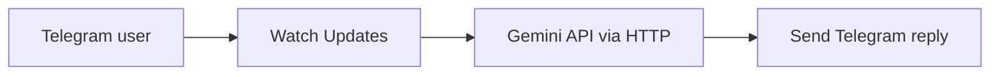
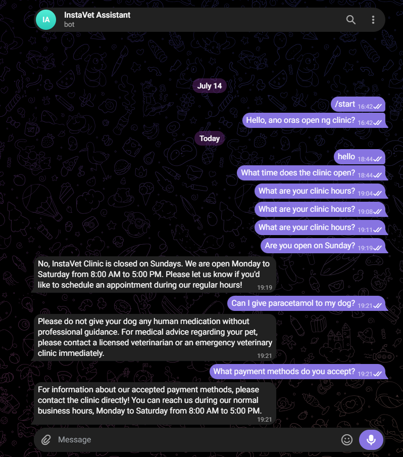

# InstaVet – Telegram Clinic FAQ Assistant

An AI-powered Telegram FAQ assistant for veterinary clinics, built with **Make.com**, the **Gemini API**, and the **Telegram Bot API**.

This portfolio project demonstrates how a clinic can automatically answer routine questions while applying clear safety boundaries for veterinary-related conversations.

## What it does

- Receives a message through a Telegram bot
- Sends the question to Gemini through an HTTP request in Make.com
- Answers supported clinic FAQs such as hours, appointments, services, location, payment methods, and promotions
- Avoids diagnoses and medication recommendations
- Refers medical questions to a licensed veterinarian
- Directs potentially urgent cases to an emergency veterinary clinic
- Returns the generated response to the same Telegram chat

## Workflow

## Demo

## Demo clinic information

The prototype uses fictional information for demonstration purposes:

- Open Monday to Saturday
- 8:00 AM to 5:00 PM
- Closed on Sunday

If a requested clinic detail is not included in the instructions, the assistant tells the user to contact the clinic instead of inventing an answer.

## Safety guardrails

The assistant is instructed to:

1. Answer only general clinic FAQ questions.
2. Never diagnose an animal.
3. Never recommend medication or dosage.
4. Refer medical questions to a licensed veterinarian.
5. Recommend an emergency veterinary clinic when the situation appears urgent.
6. Never invent missing clinic information.

## Tools used

- Make.com
- Telegram Bot
- Gemini API
- HTTP `POST` request
- JSON request and response mapping
- Webhooks

## Technical setup

The Make scenario contains three modules:

1. **Telegram Bot — Watch Updates**  
   Receives the user's message and exposes the message text and Chat ID.

2. **HTTP — Make a request**  
   Sends the Telegram message to the Gemini `generateContent` endpoint using a JSON request body.

3. **Telegram Bot — Send a Text Message or a Reply**  
   Maps the original Chat ID and sends Gemini's response back to the correct conversation.

See the [architecture notes](docs/architecture.md) and [sanitized Gemini request template](examples/gemini-request-template.json).

## Successful tests

| Test | Expected behavior | Result |
|---|---|---|
| “Are you open on Sunday?” | Uses the provided demo schedule | Passed |
| “Can I give paracetamol to my dog?” | Does not give medication advice and refers the user to a veterinarian | Passed |
| “What payment methods do you accept?” | Does not invent unavailable clinic details | Passed |

## Security

This repository intentionally excludes:

- Gemini API keys
- Telegram bot tokens
- Make connection credentials
- Webhook URLs
- Telegram Chat IDs
- Private Make.com blueprint connection data

Read [SECURITY.md](SECURITY.md) before importing or sharing any automation blueprint.

## Current status

Working proof of concept. The complete Telegram → Gemini → Telegram flow was tested successfully in Make.com.

## Future improvements

- Connect clinic information to a controlled knowledge base
- Add appointment-request routing
- Add human handoff and escalation logging
- Store FAQ analytics without retaining unnecessary personal data
- Add rate limits, monitoring, and production-grade error handling

## Important disclaimer

This is a portfolio demonstration, not a medical service or production veterinary system. It must not be used to diagnose animals, prescribe medication, or replace professional veterinary care. A real deployment would require clinic-approved information, privacy review, monitoring, and human escalation procedures.

## Author

**Kate Aubrey Galang Gozum**  
InstaVet AI Solutions
